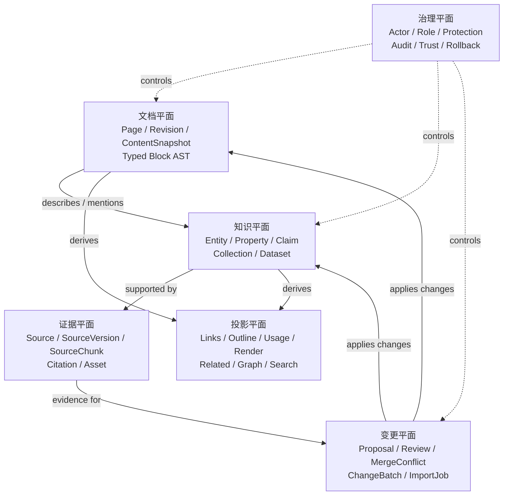
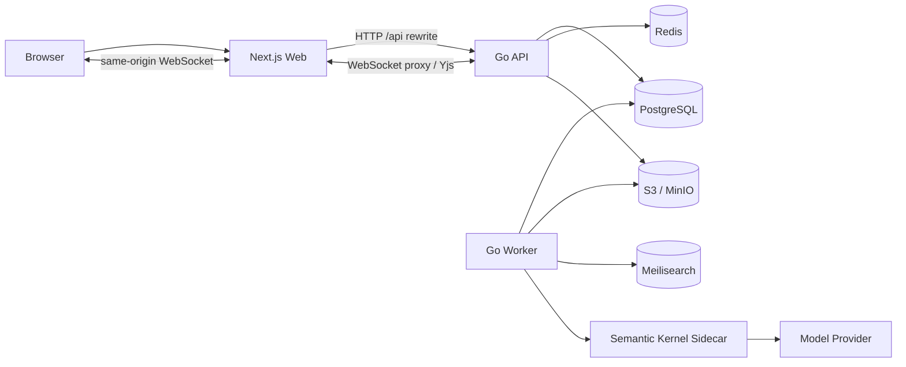
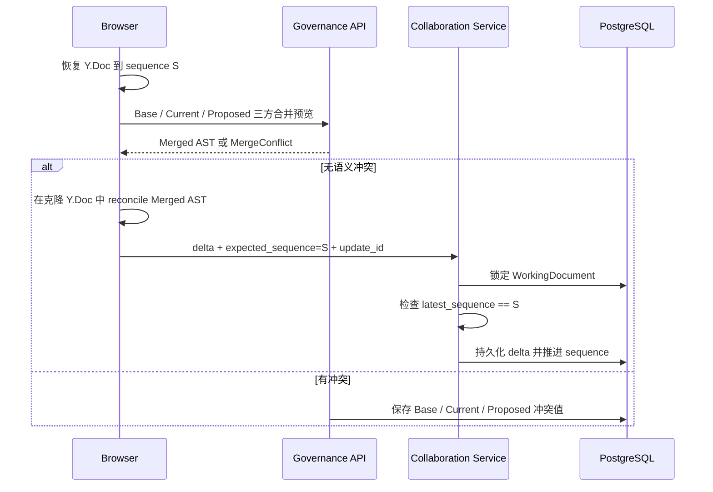
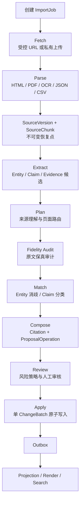
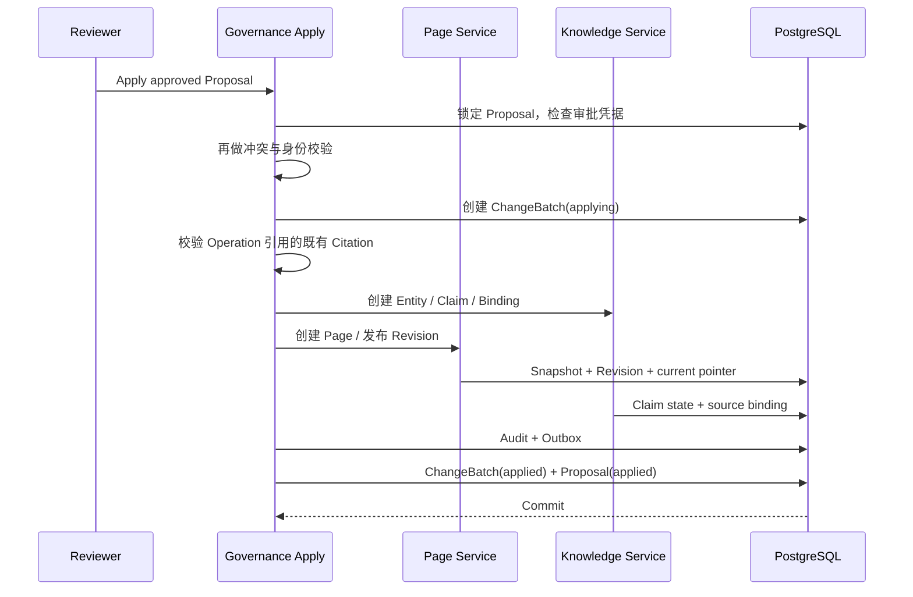

# Anby Wiki：从文档库到可验证知识系统

> 字节小团队内部技术分享详细底稿
> 副标题：一份 PDF 如何经过 AI 理解、证据校验、人工治理，最终成为可追溯的百科页面与结构化事实
> 文档日期：2026-08-17
> 项目状态：核心架构与主要业务链路已落到代码并完成本地真实联调；协作收口、生产容量、安全与可访问性仍有待验收
> 建议完整版分享时长：90 分钟；本文先保留完整细节，后续可按 30/45/60 分钟版本裁剪

---

## 0. 这次分享想回答什么

这不是一次单纯的技术栈介绍，也不是“如何用 LLM 生成 Wiki 页面”的演示。

这次分享想回答一个更完整的问题：

> 当知识既要让人阅读和协作，又要让机器理解和持续更新，还必须能回答“谁改的、依据是什么、为什么可信、出错后怎么恢复”时，知识库应该被设计成什么样？

Anby Wiki 的答案不是在传统文档上附加一个 AI 聊天框，而是把知识系统拆成几个职责明确、彼此连接的平面：

```text
结构化文档
+ 不可变版本
+ 实体与事实
+ 来源与证据
+ 提案与审核
+ 实时协作
+ 可重建投影
+ 搜索与阅读
```

它最终形成的不是“一堆 AI 生成的文章”，而是一套人工与 AI 可以共同维护、机器可操作、过程可审计、结果可回滚的知识生产系统。

### 0.1 一句话介绍

Anby Wiki 是一个面向人工与 AI 共同维护的现代百科平台：

- 人通过 Block 编辑器创作和协作；
- AI 从网页、PDF、图片、JSON、CSV 等来源理解内容；
- 系统把叙述、事实、来源和变更分开建模；
- AI 只能提出带证据的结构化变更；
- 领域服务负责校验、冲突检测、审核和原子写入；
- 正式内容以不可变 Revision 保存；
- 链接、目录、渲染和搜索由可重建投影异步生成。

### 0.2 推荐分享标题

主标题建议使用：

> **从文档库到可验证知识系统：Anby Wiki 的设计与实践**

如果希望突出 AI 导入链路，可以使用：

> **一份 PDF 如何变成可审计的知识：Anby Wiki 全链路设计**

如果希望突出协作与治理，可以使用：

> **让人和 AI 安全地共同写 Wiki：Block、CRDT、Proposal 与证据链**

### 0.3 核心结论先行

整场分享可以围绕五个结论展开：

1. **知识不等于文档。** 文档负责叙述，Entity/Claim 负责事实，Source/Citation 负责依据。
2. **AI 不应该拥有最终写权限。** 模型输出是候选和 Proposal，不是数据库命令。
3. **JSON 不是一个格式，而是一组分层协议。** AST、抽取结果、页面计划和变更操作有不同职责。
4. **协作状态不等于正式历史。** Yjs 负责工作副本收敛，Revision 负责正式、可审计的版本主线。
5. **派生数据必须可丢弃、可重建。** 链接、目录、HTML、搜索索引都不能成为反向修改正文的入口。

### 0.4 阅读路线

本文很长，可以按分享目标选择阅读路径：

- 想理解产品 Idea 和差异化：第 1、2 章；
- 想理解领域与系统架构：第 3、4、5 章；
- 想理解 JSON、Block 与实时协作：第 5、6、7、8 章；
- 想理解来源到正式入库的全链路：第 9 到 14 章；
- 想用一个案例串起全部概念：第 16 章；
- 想讨论设计取舍和当前成熟度：第 17、18、19 章；
- 想直接准备分享和 Demo：第 20 到 23 章。

---

## 1. 为什么要做这个项目

### 1.1 小团队知识管理的真实矛盾

一个小团队积累知识时，通常会经历以下过程：

```text
聊天记录
  → 在线文档
    → 多层目录
      → 搜索越来越难
        → 再接一个 RAG 问答
```

短期看，这个过程成本低、见效快；长期看，会出现几个结构性问题。

#### 问题一：知识存在，但找不到“当前正确版本”

同一个概念可能同时出现在：

- 需求文档；
- 设计文档；
- 周会纪要；
- FAQ；
- IM 对话；
- 历史方案；
- AI 生成总结。

全文搜索能找到“提到它的地方”，但不一定能找到：

- 当前结论是什么；
- 哪个结论已经废弃；
- 谁确认过；
- 依据来自哪里；
- 是否存在冲突事实。

#### 问题二：正文适合人读，不适合机器安全修改

普通富文本或 Markdown 对人友好，但机器要修改“第三节第二段里的发布日期”时，常见做法仍然是：

- 全文重写；
- 按字符串模糊替换；
- 根据标题猜段落；
- 让模型输出一份完整新文档。

这些方式很难稳定回答：

- 修改目标是否还是原来的内容；
- 页面是否在模型处理期间被人改过；
- 只改了哪个结构单元；
- 是否误删了别的段落；
- 能否只回滚这一批 AI 变更。

#### 问题三：RAG 能回答，但不自动形成长期知识

RAG 擅长“从原始材料中临时检索并回答”，但它默认不解决：

- 把答案沉淀成正式页面；
- 把事实变成可查询的结构化对象；
- 对同一事实做去重、替代和冲突管理；
- 让人工审核修改前后的差异；
- 按变更批次回滚；
- 让新知识参与页面链接、信息框、图谱和搜索投影。

RAG 更像读取层能力，不天然等于知识治理层。

#### 问题四：AI 生成速度很快，但错误传播也很快

如果模型直接写数据库或覆盖页面，会把以下风险放大：

- 幻觉；
- 引文伪造；
- 实体误合并；
- 旧版本覆盖新版本；
- Prompt Injection；
- 大批量低质量变更；
- 无法解释和回滚的连锁修改。

AI 生产知识的瓶颈并不只是生成质量，而是**写入边界与治理模型**。

### 1.2 项目的原始 Idea

这个项目的核心 Idea 可以概括为：

> 把 Wiki 从“可编辑的页面集合”升级为“可验证、可协作、可计算的知识生产系统”。

为此，项目没有把所有东西都放进一篇正文，而是明确拆分：

```text
正文叙述      → ContentSnapshot / Typed Block AST
结构化事实    → Entity / Property / Claim
来源证据      → Source / SourceVersion / SourceChunk / Citation
机器变更      → Proposal / ProposalOperation / ReviewTask
正式历史      → Page / Revision / ChangeBatch / AuditEvent
阅读与查询    → RenderedPage / Link / Usage / Search Projection
协作工作副本  → WorkingDocument / Yjs Update / Presence
```

这个拆分让每一类问题由最合适的数据模型解决：

- 文档保持可读性和编辑体验；
- 事实可以独立验证、替代和查询；
- 证据能定位到原文；
- AI 修改可审核；
- 多人协作可以实时收敛；
- 正式版本仍然不可变；
- 搜索和关系查询不用扫描所有 JSON。

---

## 2. 和其他知识库相比，它解决了什么

这里不把产品分成“先进”和“落后”，而是比较各类系统默认优先解决的问题。

### 2.1 四类常见系统

#### A. 文档协作型知识库

代表形态包括 Notion、Confluence、语雀、飞书文档等。

默认优势：

- 写作门槛低；
- 富文本和 Block 体验成熟；
- 评论、权限、协作完善；
- 适合团队日常信息沉淀。

默认短板：

- 事实通常埋在正文里；
- 同一事实可能被复制到多个页面；
- 来源和事实缺少独立生命周期；
- AI 修改常以页面或段落重写为主；
- 批量机器变更的审核、冲突和回滚不一定是核心模型。

#### B. 传统 Wiki 型系统

代表形态包括 MediaWiki。

默认优势：

- Page 与 Revision 模型成熟；
- 页面链接、历史、回滚、审核和社区治理完善；
- 稳定页面身份与标题分离；
- 非常适合长期百科内容维护。

默认短板：

- Wikitext 更偏字符串和模板语言；
- Block 级稳定身份、机器 Patch 和结构化协作不是原生中心；
- 知识图谱和事实证据通常需要扩展系统；
- AI 多来源导入与 Proposal 治理需要额外建设。

Anby Wiki 明确继承了传统 Wiki 最重要的思想：

```text
Page 是稳定身份
Revision 是不可变正式版本
回滚产生新 Revision
```

但把正文格式换成了 Typed Block AST，并将知识、证据和 AI 变更提升为一等对象。

#### C. 结构化知识库或知识图谱

代表形态包括 Wikidata、领域主数据和图谱系统。

默认优势：

- Entity/Property/Claim 可查询；
- 关系清晰；
- 事实适合机器消费；
- 可做约束、推理和聚合。

默认短板：

- 不擅长承载长篇叙述和编辑体验；
- 普通用户直接维护三元组门槛高；
- “为什么这个事实值得写成一篇文章”不是核心问题；
- 文档协作与页面级版本体验通常较弱。

#### D. RAG 或 AI 搜索型知识库

默认优势：

- 导入快；
- 无需先重构全部资料；
- 能直接用自然语言问答；
- 对非结构化材料的即时利用率高。

默认短板：

- 结果往往是查询时生成，而不是稳定知识资产；
- 引用通常停留在检索片段级；
- 缺少 Page/Revision/Claim 的正式状态；
- 缺少批量变更审核和长期维护闭环；
- 重复事实、冲突事实、已废弃事实不容易治理。

### 2.2 Anby Wiki 的组合方式

项目最终定位可以用一个组合式表达：

```text
Notion / 思源式结构化块文档
+
Wikipedia 式页面、版本与治理
+
Wikidata 式 Entity / Claim
+
Git 式 Patch、Review 与 Merge
+
CRDT 式多人实时协作
+
AI 多模态导入与持续更新
```

它的差异化不在于某一个单点功能，而在于把这些能力放入同一条数据和治理链路。

### 2.3 能力对比

| 维度 | 文档协作库 | 传统 Wiki | 结构化知识库 | RAG 知识库 | Anby Wiki |
| --- | --- | --- | --- | --- | --- |
| 长文阅读与写作 | 强 | 强 | 弱 | 通常不是核心 | 强 |
| 页面正式版本 | 产品相关 | 强 | 对象版本为主 | 通常弱 | 不可变 Revision |
| Block 稳定身份 | 部分支持 | 通常不作为核心 | 不适用 | 通常没有 | UUIDv7 Block ID |
| 结构化事实 | 属性表或数据库 | 扩展实现 | 强 | 临时抽取 | Entity/Claim 一等对象 |
| 事实证据 | 文内链接 | 引用模板 | 可扩展 | 检索片段 | Citation 精确指向 SourceChunk |
| AI 导入 | 生成页面 | 扩展能力 | 抽取导入 | 核心能力 | 抽取、计划、提案、审核全链路 |
| AI 直接写权限 | 产品相关 | 产品相关 | 产品相关 | 实现相关 | 明确禁止 |
| 变更审核 | 页面审批 | 强 | 数据审批 | 通常弱 | ProposalOperation + Review |
| 多目标原子变更 | 通常弱 | 通常弱 | 可实现 | 通常没有 | Wiki 级 Proposal + ChangeBatch |
| 实时协作 | 强 | 依实现而定 | 弱 | 不适用 | Yjs WorkingDocument |
| 正式历史与 CRDT 分离 | 产品相关 | 不适用 | 不适用 | 不适用 | 明确分离 |
| 派生关系重建 | 产品内部能力 | 部分支持 | 索引重建 | 向量重建 | 所有 Projection 可重建 |
| 事实冲突状态 | 正文表达 | 正文表达 | 强 | 查询时处理 | Claim 状态 + MergeConflict |
| 批量回滚 | 通常页面级 | 页面级 | 依实现而定 | 通常没有 | ChangeBatch 补偿回滚 |

### 2.4 它最适合的使用场景

Anby Wiki 不一定适合所有团队。它最适合同时满足以下几项的场景：

- 知识会长期演进，而不是一次性归档；
- 原始资料来自多种格式和多个来源；
- 页面内容需要 AI 持续创建或更新；
- 错误知识的成本较高；
- 需要知道某个结论的原始依据；
- 需要多人协作，但又要保留正式发布历史；
- 需要反向链接、引用使用位置、图谱和结构化搜索；
- 需要批量审核、审计和回滚。

典型例子：

- 技术标准与 RFC 知识库；
- 游戏、影视或 IP 百科；
- 产品能力和组件百科；
- 行业研究知识库；
- 内部制度、流程和事实型知识库；
- 需要从大量 PDF、网页和数据导出中持续更新的专业百科。

### 2.5 它不是什么

为了避免过度定位，项目明确不是：

- 一个只做聊天问答的 RAG 前端；
- 一个让 LLM 自由写数据库的 Agent；
- 一个只存 Markdown 文件的静态站点；
- 一个把所有字段都塞进 JSONB 的通用 CMS；
- 一个现在就拆成几十个微服务的平台；
- 一个用 CRDT Update 代替正式版本历史的协作文档。

---

## 3. 总体架构：六个逻辑平面

### 3.1 六平面模型



这六个平面不是六个微服务，而是六类职责边界。

当前实现采用：

```text
模块化单体 Go API
+ 独立 Go Worker
+ Next.js Web
+ Python Semantic Kernel Sidecar
```

原因是项目当前更需要稳定事务边界和领域模型，而不是先承担分布式事务与服务治理成本。

### 3.2 运行时架构



各组件职责：

| 组件 | 主要职责 | 明确不负责 |
| --- | --- | --- |
| Next.js Web | 阅读、编辑、审核、导入、治理和管理界面 | 不手写服务端 DTO，不保存第二份权威服务端数据 |
| Go API | 同步领域操作、鉴权、发布、查询、WebSocket 协作入口 | 不在 Handler 中直接拼 SQL 修改权威状态 |
| Go Worker | Outbox、Projection、导入、OCR、渲染、搜索同步 | 不绕过领域服务写 Page/Claim 等权威对象 |
| Semantic Kernel Sidecar | 模型调用、有限重试、JSON 解析与 Schema 预校验 | 不访问数据库、对象存储、用户会话，不发布内容 |
| PostgreSQL | 权威状态、Outbox、Projection staging、协作持久化 | 不作为不可替代的外部搜索产品 |
| Redis | 限流和短期协调 | 不承载不可丢失的权威任务 |
| S3/MinIO | 原始来源、资产、冷 Revision 快照 | 不保存可查询的领域关系 |
| Meilisearch | 关键词、过滤、混合和语义搜索 | 不作为正文或事实的权威源 |

### 3.3 仓库中的架构边界

```text
apps/web/
  Next.js 页面、组件、编辑器与生成客户端

backend/cmd/api/
  HTTP API 入口，只做装配和协议适配

backend/cmd/worker/
  Outbox、Projection、导入和运维命令入口

backend/internal/page/
  Page / Revision / ContentSnapshot 权威服务

backend/internal/knowledge/
  Entity / Property / Claim 权威服务

backend/internal/evidence/
  Asset / Source / Citation 权威服务

backend/internal/governance/
  Proposal / Review / Apply / Rollback 安全边界

backend/internal/importer/
  来源导入编排，不直接拥有其他领域的权威写入

backend/internal/projection/
  可重建投影和 Outbox 消费

contracts/
  OpenAPI 3.1、JSON Schema、生成的 TypeScript 客户端
```

### 3.4 两类数据：权威状态与派生状态

权威数据包括：

```text
Page
Revision
ContentSnapshot
Entity
Claim
Source
Citation
Proposal
AuditEvent
```

可重建投影包括：

```text
PageLinkProjection
DocumentOutlineProjection
EntityMentionProjection
ClaimUsage
CitationUsage
ComponentDependency
RenderedPage
RenderedSection
RelatedPage
EntityGraph
SearchDocument
Meilisearch Index
```

这条边界的核心规则是：

> 投影只能从权威数据生成，不能反向成为修改权威内容的入口。

例如，页面新增一个内部链接时：

```text
AST 新增 PageReference
  → 发布 Revision
    → 写 OutboxEvent
      → Worker 解析 Current AST
        → 重建 page_link_projection
```

不能通过直接插入 `page_link_projection` 来“创造”一个页面链接。

---

## 4. 核心领域模型

### 4.1 Page 不是正文

`Page` 是页面的稳定身份，保存标题、语言、状态、当前 Revision 指针等元数据。

```text
Page
├── PageAlias
├── PageRedirect
├── Revision History
├── PageEntityBinding
├── PageProtection
└── Current Revision
```

页面改名时：

```text
Page ID 不变
标题更新
旧标题进入 PageAlias
旧地址继续可以解析
正文中的已解析引用无需改写
```

这避免了把标题当主键造成的级联修改。

### 4.2 Revision 与 ContentSnapshot

`Revision` 表示一次正式发布，保存：

- 所属 Page；
- 父 Revision；
- ContentSnapshot；
- 编辑者；
- 修改摘要；
- ChangeBatch；
- 创建时间；
- 可见性；
- 小修改标记。

`ContentSnapshot` 保存：

- AST Schema 版本；
- 完整 canonical AST JSON；
- SHA-256 内容哈希；
- 内容大小；
- 热存储或冷存储位置。

核心不变量：

> Revision 和逻辑 ContentSnapshot 发布后不可修改。

正文变更只能产生：

```text
新 ContentSnapshot
+ 新 Revision
```

回滚也不是修改旧版本，而是复用旧内容创建一个新的 Revision。

### 4.3 Entity 与 Page 不是一一对应

`Entity` 表示稳定的现实或虚构对象，例如：

- Person；
- Organization；
- Place；
- Work；
- Product；
- Concept；
- Software。

Entity 与 Page 的关系可以是：

```text
一个 Entity
├── 中文页面
├── 英文页面
├── 专题页面
└── 其他语言页面

一个 Page
├── 描述一个主 Entity
└── 提到多个其他 Entity
```

因此页面改名、换语言或拆分专题时，不会改变知识对象本身的身份。

### 4.4 Claim 是独立事实

一个 Claim 由以下部分组成：

```text
Subject
+ Property
+ Value
+ Qualifier
+ Valid Time
+ Source
+ Verification Status
```

它支持：

- 字符串；
- 数字；
- 日期；
- Entity 引用；
- 坐标；
- 复合 JSON 对象；
- 多值；
- 时间有效性；
- 验证状态；
- Supersede 链。

业务状态与验证状态被拆成两个正交维度：

```text
业务状态：
proposed / published / rejected / superseded / deprecated

验证状态：
unverified / ai_checked / human_verified / disputed
```

这样，“事实当前是否生效”和“事实经过谁验证”不会混在一个枚举里。

### 4.5 Source、SourceVersion、SourceChunk 与 Citation

来源模型不是只保存一个 URL。

```text
Source
  → SourceVersion
    → SourceChunk
      → Citation
```

- `Source`：逻辑来源，例如某个网页、PDF、书籍或 API；
- `SourceVersion`：某个时间点的不可变版本；
- `SourceChunk`：带页码、章节、字符范围或图片区域的可定位片段；
- `Citation`：指向 SourceVersion/Chunk 中具体位置和可选原文引文。

Citation 的引文必须能在不可变 Chunk 中逐字复核，无法定位的模型引文不能直接入库。

### 4.6 Proposal 与 ChangeBatch

`Proposal` 表示尚未正式生效的变更建议。

它包含一组严格有序、版本化的 `ProposalOperation`，可以同时修改：

- Page；
- Block；
- 引用；
- Entity；
- Claim；
- Page 与 Entity 绑定；
- Collection 成员。

审核通过后，由 Apply Service 在单一事务中创建 `ChangeBatch` 并完成正式写入。

`ChangeBatch` 用于：

- 关联一次 AI 导入；
- 批量审计；
- 原子提交；
- 整批回滚；
- 追踪受影响的 Page、Revision、Entity 和 Claim。

---

## 5. JSON 设计：不是一个大 JSON，而是四层协议

项目大量使用 JSON，但没有让一个模型输出的“大 JSON”直接贯穿所有层。

目前最关键的四套契约是：

| 层级 | 契约 | 表达什么 | 是否权威 |
| --- | --- | --- | --- |
| 正式内容 | Typed Block AST v1 | 页面当前正文结构 | 是，存入 ContentSnapshot |
| 模型理解 | Extraction Candidates v1 | Entity/Claim 候选与证据 | 否，是不可信中间结果 |
| 页面规划 | ImportPlan v1 | 来源应该创建、更新、关联或忽略哪些页面 | 否，是经校验的写作计划 |
| 变更协议 | ProposalOperation v1 | 可审核、可冲突检测、可应用的原子操作 | 是治理输入，Apply 后才改变正式状态 |

另有一类特殊协议：

| 层级 | 契约 | 表达什么 |
| --- | --- | --- |
| 协作状态 | Yjs binary update + collaboration message v1 | WorkingDocument 的增量操作与恢复游标 |

Yjs 二进制状态不会直接成为正式 Revision。

### 5.1 JSON 契约的共同原则

#### 原则一：明确版本

每份重要契约都有 `schema_version`：

```json
{
  "schema_version": 1
}
```

AST v1 只允许加法演进：

- 可以新增 Block 类型；
- 可以新增 Inline 类型；
- 可以新增可选字段；
- 删除、重命名、收窄语义必须进入 v2。

#### 原则二：严格拒绝未知字段

核心 Schema 普遍使用：

```json
{
  "additionalProperties": false
}
```

这样可以防止：

- 模型“顺手”增加未定义字段；
- 前后端字段拼写错误被静默忽略；
- 老消费者误读新语义；
- 数据以看似合法但无人理解的形态落库。

#### 原则三：稳定 ID 与显示文本分离

例如页面引用：

```json
{
  "type": "page_reference",
  "target_page_id": "0198a2b4-50ad-7b21-8b31-f7051c04a901",
  "display_text": "系统架构"
}
```

页面改名时：

- `target_page_id` 不变；
- `display_text` 可以按上下文保留；
- 不需要全库扫描并替换标题字符串。

#### 原则四：服务端重新计算机械字段

模型不被信任去决定：

- 持久化 ID；
- Content Hash；
- SourceVersion ID；
- 字符位置；
- Page 当前 Revision；
- ChangeBatch；
- 最终风险和质量分。

模型主要输出语义选择和原文 quotation，服务端补全机械字段并再次验证。

#### 原则五：Canonical JSON 与稳定哈希

AST 在正式入库前会 canonicalize：

- 对象键固定排序；
- 去除无意义空白；
- 统一字符串转义；
- 只允许安全整数；
- 服务端计算 SHA-256。

因此语义相同但键顺序不同的 JSON 会得到同一内容哈希。

这个哈希用于：

- ContentSnapshot 去重；
- Block 级乐观锁；
- Proposal `expected_hash`；
- Diff 与冲突检测；
- 热冷存储回源校验。

### 5.2 Claim 的 `value_json`：有限多态，不是任意 JSON

结构化事实需要支持不同值类型，但项目没有为每种 Property 建一张独立表，也没有允许任意 JSON 直接进入 Claim。

Property 先声明 `value_type`，Claim 的 `value_json` 再按该类型解释：

| value_type | `value_json` 示例 | 主要校验 |
| --- | --- | --- |
| string | `"Anby Wiki"` | 非空字符串 |
| number | `1.0` | 合法有限数字，拒绝 NaN/Inf |
| date | `"2026-07-22"` | `YYYY-MM-DD` |
| entity | `{"entity_id":"..."}` | Entity 存在、active、目标类型匹配 |
| coordinate | `{"lat":39.9,"lon":116.4}` | 纬度和经度范围 |
| composite | `{"major":1,"minor":0}` | 必须是 object，并通过 Property 的 JSON Schema |

Entity 值还会冗余出 `target_entity_id` 关系列，用于：

- 外键；
- 类型校验；
- 图谱投影；
- 高效关系查询；
- Entity 合并与修复。

Property 可以在 `schema_json` 中继续约束：

- 主体 Entity 类型；
- 目标 Entity 类型；
- 完整 value Schema；
- qualifier Schema；
- 是否允许多值。

这里采用 JSON 的原因是“值形态有限多态”，不是为了逃避建模。

### 5.3 OpenAPI 与跨语言契约

HTTP API 的权威契约是 OpenAPI 3.1。

契约变更流程固定为：

```text
修改 contracts/openapi
  → make gen-client
    → 生成 TypeScript 客户端
      → 提交生成物 diff
        → CI 检查漂移
```

前端所有 HTTP API 调用都通过 `apps/web/lib/api.ts` 创建的生成客户端完成，不在页面中手写 URL 和 DTO。协作 WebSocket 不属于 OpenAPI HTTP 调用，由独立的 `CollaborationClient` 封装版本化消息和二进制帧。

JSON Schema 则负责 HTTP 之外或需要更严格判别联合的协议：

- AST；
- Extraction；
- ImportPlan；
- ProposalOperation；
- Collaboration message；
- Search document；
- AI Kernel 内网请求。

Go 因为 `go:embed` 不能跨 Module 边界直接引用仓库根契约，会保存字节级 Schema 副本；CI 检查权威文件与嵌入副本一致，禁止从副本反向修改契约。

---

## 6. Typed Block AST：正式正文的数据结构

### 6.1 为什么不用 Wikitext、HTML 或纯 Markdown 作为权威格式

HTML 适合展示，不适合成为安全编辑协议：

- 展示标签和语义结构混杂；
- XSS 面大；
- Patch 目标不稳定；
- 很难约束允许的结构。

Markdown 适合文本创作，但对以下能力表达不足：

- 稳定 Block ID；
- Entity/Claim/Citation 引用；
- 冻结 ComponentVersion；
- DatasetView；
- 可验证的树形容器规则；
- 块级移动、Diff 和冲突检测。

Wikitext 有成熟生态，但本项目更需要：

- 编辑器与 AI 共用的结构化协议；
- 类型严格的引用节点；
- 直接按 Block 操作；
- JSON Schema 跨 Go/TypeScript 校验。

因此正文采用 Typed Block AST。

### 6.2 根结构

```json
{
  "type": "document",
  "schema_version": 1,
  "children": []
}
```

当前 Block 类型包括：

```text
heading
paragraph
bullet_list
ordered_list
list_item
table
table_row
table_cell
code
quote
callout
component
image
video
dataset_view
embed
divider
```

Inline 类型包括：

```text
text
inline_code
page_reference
page_anchor_reference
external_link
entity_reference
claim_reference
citation_reference
math
mention
```

### 6.3 一份简化的 AST 示例

```json
{
  "type": "document",
  "schema_version": 1,
  "children": [
    {
      "id": "0198a2b4-50ad-7b21-8b31-f7051c04a901",
      "type": "heading",
      "level": 2,
      "content": [
        {
          "type": "text",
          "text": "系统定位"
        }
      ]
    },
    {
      "id": "0198a2b4-50ad-7b21-8b31-f7051c04a902",
      "type": "paragraph",
      "content": [
        {
          "type": "entity_reference",
          "entity_id": "0198a2b4-50ad-7b21-8b31-f7051c04b001",
          "display_text": "Anby Wiki"
        },
        {
          "type": "text",
          "text": " 是一个人工与 AI 共同维护的现代百科平台"
        },
        {
          "type": "citation_reference",
          "citation_id": "0198a2b4-50ad-7b21-8b31-f7051c04c001"
        }
      ]
    }
  ]
}
```

这里有三个关键点：

1. Heading 和 Paragraph 都有稳定 Block ID；
2. Entity 引用保存稳定 ID，不复制 Entity 快照；
3. Citation 引用保存稳定 Citation ID，References 由投影生成。

### 6.4 Block ID 的意义

每个可独立移动、修改、引用或冲突检测的 Block 都使用 UUIDv7。

Block ID 用于：

- AI 精确替换一个 Block；
- 块级 Diff；
- 判断目标是否被别人修改；
- 稳定章节锚点；
- 页面内引用定位；
- Citation 使用位置；
- BlockRedirect；
- CRDT 移动后保持业务身份；
- Proposal 的 `target.block_id`。

标题文本会变，章节位置会变，但 Heading Block ID 可以不变。

### 6.5 容器规则

AST 不是任意树：

```text
bullet_list / ordered_list
  → children 只能是 list_item

table
  → table_row
    → table_cell
      → 任意 Block

heading / paragraph
  → content 是 InlineNode[]

code
  → content 是 string

divider
  → 没有 content 和 children
```

这些规则同时由：

- JSON Schema；
- Go 类型与校验；
- 前端 Zod；
- 编辑器 Adapter；
- 服务端发布校验；

共同保护。

### 6.6 页面引用的两种形态

已解析引用：

```json
{
  "type": "page_reference",
  "target_page_id": "0198a2b4-50ad-7b21-8b31-f7051c04a901",
  "target_heading_block_id": "0198a2b4-50ad-7b21-8b31-f7051c04a902",
  "display_text": "导入流程"
}
```

未解析引用：

```json
{
  "type": "page_reference",
  "resolution_status": "unresolved",
  "target_namespace": "main",
  "normalized_title": "未来页面",
  "expected_entity_type": "software"
}
```

当目标页面以后被创建时，Worker 可以更新链接投影，但不会偷偷修改已发布 AST。

---

## 7. Block-based 编辑体验

### 7.1 编辑器选型与边界

前端使用 BlockNote，底层是 ProseMirror/TipTap 生态。

但业务代码不直接依赖 BlockNote 内部模型，而是通过 Adapter：

```text
Typed Block AST
  ↔ BlockEditor Adapter
    ↔ BlockNote Document
```

这样做的原因：

- AST 是项目自己的长期内容契约；
- 编辑器只是可替换的交互实现；
- BlockNote major 升级不会直接污染业务模型；
- AI、Renderer、Diff、Proposal 不需要理解编辑器私有结构。

### 7.2 双向转换

进入编辑页：

```text
ContentSnapshot AST
  → fromAst
    → BlockNote Document
      → 用户编辑
        → toAst
          → Zod parseDocument
            → 最新 AST
```

发布时，服务端还会用权威 JSON Schema 再校验一次。

### 7.3 Block ID 如何保持稳定

已有 AST Block ID 直接传给 BlockNote。

新建 Block 时：

- BlockNote 可能先分配自己的 ID；
- Adapter 在序列化边界将其稳定映射为 UUIDv7；
- 同一编辑会话中映射保持不变；
- 已有块编辑和移动不改变 Block ID。

列表因为编辑器模型与 AST 模型不同，还需要额外记录：

- List 容器 ID；
- 提升到列表项行内内容的 Paragraph ID；
- 新建块的 ID 映射。

### 7.4 显式拒绝有损特性

Adapter 的重要原则不是“尽量转换”，而是：

> 不能无损表达的编辑器特性，要么明确降级，要么明确报错，不能静默丢失。

例如：

- AST 不支持的文本颜色；
- 下划线；
- 未建模的原生文件块；
- Link 内复杂样式；
- 未知 Block props；
- 非法 Callout kind。

这些情况会在 Adapter 边界抛出错误，而不是发布后才发现内容消失。

### 7.5 用户看到的编辑能力

当前编辑页已经提供的直接交互入口包括：

- 标题、段落、列表、表格等 BlockNote 基础编辑；
- 页面引用和未解析引用；
- 外部链接；
- 主 Entity 信息框；
- 标准“参见”“拓展阅读”“外部链接”章节；
- 修改摘要和小修改标志；
- 本地草稿恢复；
- 发布冲突提示；
- 实时协作连接状态。

Adapter 和 AST 往返层还支持：

- Code、Quote、Callout；
- Entity、Claim、Citation 引用；
- 图片、视频、DatasetView、Embed；
- Component、页内锚点、数学表达式与 Mention。

后面这组能力不等于编辑器已经为每种节点提供人工插入按钮。它们目前主要服务于已有 AST 的无损编辑、AI/Proposal 生成内容和阅读渲染；补齐统一的人工插入选择器仍属于产品体验工作。

### 7.6 本地草稿不是正式版本

Zustand 只保存当前编辑会话，localStorage 草稿只用于：

- 浏览器误关恢复；
- 网络中断恢复；
- 发布失败后保留内容。

它不会自动发布，也不会成为服务端权威状态。

如果草稿基于旧 Revision：

- 草稿内容保留；
- 页面提示 Base 与 Current 冲突；
- 用户可以查看差异；
- 用户可以以最新版为新基线继续编辑；
- 或放弃本地修改。

---

## 8. 同步编辑：CRDT 解决操作收敛，Revision 解决正式历史

### 8.1 为什么需要两个模型

实时协作和正式版本解决的是两类不同问题。

`WorkingDocument + Yjs` 的设计目标是解决：

- 多客户端同时输入；
- 字符插入和删除；
- Block 新增、删除和移动；
- 离线更新；
- 断线重连；
- 光标与在线状态。

`Page + Revision` 解决：

- 哪个版本已经正式发布；
- 谁发布的；
- 修改摘要是什么；
- 当前版本的父版本是什么；
- 如何审核、Diff 和回滚。

因此：

```text
CRDT 状态 ≠ 正式版本历史
```

当前实现已经具备在线增量同步、持久 update、普通发布与 AI 合并的 sequence CAS、同标签页断线重发、自动 snapshot/compact 和 Block 级 Presence，但不能把全部设计目标都视为完成的产品体验。跨标签页离线恢复、字符级光标和多副本广播的当前边界会在本章后续明确说明。

### 8.2 Yjs 与 AST 的映射

当前映射：

```text
AST Object      → Y.Map
有序集合        → Y.Array
可协作正文文本  → Y.Text
稳定 ID/类型    → 标量
```

其中：

- `id`、`type`、引用目标、URL 和枚举保持标量；
- `text`、`display_text`、可编辑 `content` 使用 Y.Text；
- CRDT 内部 item ID 不能替代 AST UUIDv7；
- Block 移动后仍保留同一个 AST Block ID。

当前浏览器集成不是把 BlockNote 直接绑定到 `y-prosemirror`。编辑器每次变化先序列化为 AST，再由 `syncYjsAst` reconcile 到 Y.Map/Y.Array/Y.Text；远端 AST 到达后则更新会话并重挂载编辑器。这个方案保持了 AST Adapter 边界，但协作光标、原生 transaction 保留和大文档重挂载性能仍需要单独完善。

### 8.3 实时同步协议

连接端点：

```text
GET /api/v1/pages/{page_id}/collaboration
    ?client_id={uuid}
    &last_sequence={n}
```

服务端依次发送：

1. JSON `hello`；
2. 可选 Yjs snapshot 二进制帧；
3. snapshot 之后的增量 update；
4. JSON `ready`；
5. 后续实时 update 与 presence。

服务端二进制帧：

```text
Byte 0     : 1=snapshot, 2=update
Byte 1..8  : durable server sequence，大端序
Byte 9..   : opaque Yjs payload
```

客户端 update 帧：

```text
Byte 0..15 : client update UUID，幂等键
Byte 16..  : opaque Yjs update
```

### 8.4 Go 服务端为什么不解析 Yjs

Go 协作服务把 Yjs bytes 当作 opaque payload。

它负责：

- 鉴权；
- 更新大小限制；
- 幂等键；
- 单调 server sequence；
- 持久化；
- 广播；
- snapshot/compact 的存储服务能力；
- 断线补发。

它不负责：

- 理解 Yjs 内部结构；
- 把 Yjs 当正式 AST；
- 在服务端擅自合并语义冲突。

最终发布前，浏览器把 Yjs 状态物化为 AST，前后端分别校验。

### 8.5 持久化与重连

协作数据表包括：

```text
working_document
working_document_update
working_document_snapshot
```

每个 update 有：

- document_id；
- server sequence；
- actor_id；
- client_id；
- client_update_id；
- update bytes；
- SHA-256；
- created_at。

重连时：

- 客户端携带最后应用的 sequence；
- 如果游标早于 compact 点，服务端先发最新 snapshot；
- 再发送 snapshot 后的 updates；
- 如果游标仍有效，只发之后的 updates。

重复 Yjs update 是安全且预期的。

客户端在累计 100 个已确认 durable sequence、没有 pending update 且连接 ready 时，
把最多 16 MiB 的 Yjs state 作为 snapshot 请求发送。服务端通过
`SaveSnapshot(..., compact=true)` 在同一事务中保存 snapshot 并删除 covered update，
随后广播 `snapshot_saved`。远端 E2E 已验证 last_sequence 早于 compact 点的客户端
只恢复 snapshot 和后续 update，不会再次收到被覆盖 update。

断线期间的浏览器编辑也需要分层说明：

- 已经完成首次同步的同一标签页发生瞬时断线时，本地 Yjs update 会保留稳定幂等 ID；
- 重连时先按 sequence 恢复远端 update，再在本地 Y.Doc 合并并重发未确认 update；
- 服务端回显相同 payload 后，客户端才从待确认队列移除该 update；
- 浏览器关闭、重载或首次连接前的草稿仍以完整 AST 恢复，不是持久化的离线 Yjs 操作日志。

因此当前可以确认同标签页瞬时断线的操作级合并，不能扩大为跨标签页或浏览器重启后的完整离线 CRDT 保证。

### 8.6 Presence 协议与当前 UI

Presence 在协议中用于表示：

- 谁在线；
- 光标在哪；
- 当前选区等临时状态。

它最多 4 KiB，不写数据库，服务重启后消失。

这是刻意的边界：

```text
内容更新是持久状态
Presence 是易失状态
```

当前 BlockEditor 会发送稳定 Block ID 与选区类型，客户端每 10 秒刷新 Presence；服务端注入可信 Actor ID、排除发送者后广播，编辑页按 30 秒 TTL 展示远端 Actor 短 ID 与 Block 短 ID。首版已经形成 Block 级在线位置提示，但还没有 Actor 名称解析、字符偏移和编辑器 Decoration，不能描述成 Google Docs 式精确协作光标。

### 8.7 正式发布与换基

发布 WorkingDocument 时，在一个数据库事务内：

1. 锁定 Page；
2. 锁定 WorkingDocument；
3. 检查 `base_revision_id`；
4. 检查 `expected_revision_id == page.current_revision_id`；
5. 检查发布者物化 AST 时的 `expected_sequence == latest_sequence`；
6. 通过 Page Service 创建新 Snapshot 和 Revision；
7. 更新 Page current pointer；
8. WorkingDocument 换基到新 Revision；
9. 写 Audit 与 Outbox。

任一步失败，WorkingDocument 和 Revision 都不会留下半成品。

普通发布现在要求 `working_document_id + expected_sequence` 成对出现。前端会等待本地 update 获得服务端回显，并直接从同一个 Y.Doc 物化发布 AST；如果其他客户端在检查后抢先提交 update，事务内 sequence CAS 返回 409，前端重新恢复 WorkingDocument，而不会发布旧工作副本。

### 8.8 CRDT 不能解决的语义冲突

CRDT 可以让两个字符操作收敛，但不能判断：

- 两个人把同一事实改成不同值，谁对；
- AI 修改的 Block 已经被人工删除，是否应该恢复；
- 页面已改名，旧 Proposal 是否仍适用；
- Entity 已被合并，旧目标是否要重定向；
- 人工验证 Claim 是否允许被覆盖。

这些冲突由 Proposal 三方合并和 `MergeConflict` 处理。

### 8.9 AI 如何合并到 WorkingDocument

AI 合并采用客户端辅助的 Yjs CAS：



如果预览后又有人工 update 到达：

- sequence 已变化；
- CAS 拒绝旧 delta；
- 客户端恢复最新状态；
- 重新做三方合并。

合并进 WorkingDocument 仍不等于正式发布。

### 8.10 当前横向扩展边界

Yjs update 会先持久化到 PostgreSQL，但实时广播使用进程内 `Hub`。当前生产 Compose 只有一个 API 实例，因此这一拓扑可以工作；如果未来水平扩展多个 API 副本，不同副本上的 WebSocket 客户端不会直接收到彼此的实时广播，需要增加跨实例 Pub/Sub 或强制同一 WorkingDocument 的连接粘在同一副本。

---

## 9. AI 导入：从来源到正式知识的完整流程

这是项目最核心的一条端到端链路。

### 9.1 总览



当前产品将进度显示为七个执行阶段，外加完成状态：

| 阶段 | 进度 | 主要产物 |
| --- | ---: | --- |
| fetch | 8% | 原始来源、安全校验结果 |
| parse | 22% | SourceVersion、SourceChunk |
| extract | 42% | Entity/Claim Candidates |
| plan | 65% | ImportPlan |
| match | 78% | EntityResolution、ClaimDecision |
| compose | 90% | Proposal + Operations |
| review | 96% | ReviewTask / 提交审核 |
| complete | 100% | Job 完成并关联 Proposal |

### 9.2 第 0 步：创建 ImportJob

HTTP API 的：

```text
POST /api/v1/import-jobs
```

只创建队列项，不在请求线程中跑模型。

Job 保存：

- 发起人；
- 幂等键；
- 来源配置；
- 指定页面或自动路由模式；
- 用户给出的标题与导入要求；
- 当前阶段和进度；
- SourceVersion 与 Proposal 链接；
- 稳定错误码。

Worker 使用 `FOR UPDATE SKIP LOCKED` 领取任务，支持多 Worker 并发。

### 9.3 第 1 步：来源获取与安全门禁

支持的输入包括：

- URL；
- HTML；
- 纯文本；
- PDF；
- PNG；
- JPEG；
- JSON；
- CSV。

上传路径：

```text
Browser
  → API
    → Evidence Service
      → 私有对象存储
        → Job 只保存 object key + content hash
```

Worker 读取时会再次校验：

- MIME；
- magic bytes；
- 内容大小；
- 恶意签名；
- 内容哈希。

URL 路径包含 SSRF 防护：

- 只允许 HTTP(S)；
- 只允许 80/443；
- 每次重定向重新校验；
- DNS 解析与 Dial 时都拒绝内网、回环、link-local、CGNAT 等地址；
- 防止 DNS rebinding；
- 默认最大 10 MiB。

来源中的脚本或指令只被当作数据，不执行。

### 9.4 第 2 步：先固化来源，再解析

原始资产和 Source 会在解析前持久化。

原因是：

- 解析可能失败；
- OCR 组件可能缺失；
- 模型可能超时；
- 后续需要复现；
- 不能因为一次处理失败丢失原始证据。

来源元数据在有界窗口中推导：

- title；
- author；
- publisher；
- publish date；
- DOI 或标识符；
- language；
- URL host；
- 文件名；
- MIME。

只保存短元数据，不把正文、Prompt、密钥写进日志或错误字段。

### 9.5 第 3 步：解析与 OCR

#### HTML 与文本

- 抽取正文；
- 去除脚本执行面；
- 保留可定位文本；
- 按语义边界分 Chunk。

#### JSON 与 CSV

- 公网 JSON 视为 API 快照；
- 上传 JSON/CSV 视为数据库记录导出；
- 规范化为可读、可定位的文本 Chunk；
- 不执行其中的表达式或脚本。

#### 标准 PDF

- 使用 Poppler `pdftotext`；
- PDF 从标准输入传入；
- 文本从标准输出读取；
- 不把 Worker 全部环境变量传给子进程；
- 页间换页符保留页码；
- 解压后文本有 32 MiB 上限。

#### 扫描 PDF 与图片

- 无文本层 PDF 逐页栅格化；
- Tesseract OCR；
- 最多处理 20 页；
- 单页临时图随页删除；
- PNG/JPEG 走同一 OCR 链路；
- 限制 4000 万像素；
- 保存 OCR 行级像素区域、图像尺寸、引擎、语言和置信度。

因此 Citation 不仅可以定位字符范围，也可以还原到图片区域。

### 9.6 第 4 步：生成不可变 SourceVersion 与 SourceChunk

解析结果通过 Evidence Service 写入：

```text
Source
  → SourceVersion(version_hash)
    → SourceChunk(ordinal, text_hash, locator)
```

去重规则：

- 同一 Source 的同一 `version_hash` 复用 SourceVersion；
- Chunk 由服务端计算 `text_hash`；
- SourceVersion 与 SourceChunk 不可变；
- 同一证据的 Citation 可幂等复用。

解析成功后，这里成为恢复点。

如果后续模型调用失败，重试会：

- 跳过 fetch；
- 跳过 parse；
- 复用已安全扫描的 SourceVersion 与 Chunk；
- 不重复创建来源；
- 从 extract 继续。

同一 SourceVersion 的 Extraction 是不可变且可以复用的，因为“原文里有哪些候选事实”不应随某次重试变化。ImportPlan 则按 ImportJob、用户要求和页面目标独立生成，因为同一份来源可以被用于不同的页面规划。

### 9.7 第 5 步：分窗抽取 Entity、Claim 与证据

抽取使用 `Extraction Candidates v1`。

示例：

```json
{
  "schema_version": 1,
  "source_version_id": "0198a2b4-50ad-7b21-8b31-f7051c04d001",
  "entities": [
    {
      "candidate_id": "0198a2b4-50ad-7b21-8b31-f7051c04e001",
      "type_key": "software",
      "label": "Anby Wiki",
      "aliases": [],
      "confidence": 0.96,
      "evidence": [
        {
          "chunk_id": "0198a2b4-50ad-7b21-8b31-f7051c04f001",
          "quotation": "Anby Wiki released on 2026-07-22.",
          "char_start": 0,
          "char_end": 33,
          "page": 1
        }
      ]
    }
  ],
  "claims": [
    {
      "candidate_id": "0198a2b4-50ad-7b21-8b31-f7051c04e002",
      "subject": {
        "candidate_id": "0198a2b4-50ad-7b21-8b31-f7051c04e001"
      },
      "property_key": "release_date",
      "value": {
        "date": "2026-07-22"
      },
      "confidence": 0.94,
      "evidence": [
        {
          "chunk_id": "0198a2b4-50ad-7b21-8b31-f7051c04f001",
          "quotation": "Anby Wiki released on 2026-07-22.",
          "char_start": 0,
          "char_end": 33,
          "page": 1
        }
      ]
    }
  ],
  "quality_score": 0.93,
  "prompt_injection_detected": false
}
```

注意：

- `candidate_id` 是临时候选身份，不是模型猜测的数据库 ID；
- 同批 Claim 通过 `candidate_id` 引用 Entity；
- 每个候选必须有证据；
- 模型返回的 quality score 不会成为最终页面质量分。

Entity/Claim 候选允许同时为空。事实抽取只是增强层，一份不命中固定 Property 词表的来源仍可能有百科写作价值，后续 ImportPlan 会继续判断是否值得创建或更新页面。

### 9.8 模型窗口与并发策略

管理员可以配置：

- Provider；
- Base URL；
- Model；
- 输出模式；
- 最大输入 Token；
- 来源 Chunk 字符数；
- 超时；
- 尝试次数；
- API Key。

默认：

```text
模型最大输入：128000 Token
持久 Chunk 上限：32000 Unicode 字符
单批最多：6 个 Chunk
并行批次：最多 3
```

Worker 会：

1. 为 Prompt 和 Schema 预留 Token；
2. 按 Token 预算和 Chunk 上限分批；
3. 并行调用；
4. 对每批独立做 Schema 与证据校验；
5. 服务端重建候选 ID；
6. 跨批去重合并。

如果输出截断或结构不合法：

- 只二分失败的模型窗口；
- 即使持久 Chunk 只有一个，也可以创建临时语义子窗口；
- 验证后再映射回原始 Chunk ID 和全局字符位置；
- 不新增虚假的 SourceChunk。

### 9.9 Semantic Kernel Sidecar 的边界

当前模型调用经过私网 Semantic Kernel Sidecar。

Sidecar 负责：

- OpenAI-compatible 或 DeepSeek 连接；
- 结构化输出模式；
- JSON 解析；
- 权威 Schema 预校验；
- 有限纠正重试；
- Token 用量返回。

Go Worker 仍然负责：

- ImportJob；
- Prompt Registry；
- 最终 JSON Schema 校验；
- 逐字证据校验；
- Prompt Injection 检测；
- 候选去重与方向约束；
- 用量审计；
- ImportPlan；
- Proposal；
- 所有正式写入。

这个边界让模型运行时可以替换，但不会改变领域写入规则。

### 9.10 第 6 步：证据校验与坏候选隔离

模型输出首先被视为不可信输入。

服务端依次验证：

1. JSON 是否合法；
2. 是否符合 Extraction Schema；
3. `source_version_id` 是否是请求中的权威版本；
4. Chunk 是否属于该 SourceVersion；
5. quotation 是否逐字存在；
6. 字符范围是否正确；
7. Candidate ID 是否重复或悬空；
8. Entity 关系方向和类型是否成立；
9. 是否出现 subject=target 自引用；
10. 有效时间是否合法；
11. 是否检测到 Prompt Injection。

模型常见的 Unicode 字节偏移错误会由服务端重新定位。

如果 quotation 正确但 Chunk ID 错误：

- 只有当引文在同一 SourceVersion 中能唯一定位时才修复；
- 否则丢弃该证据。

如果单条 Claim 坏了：

- 淘汰该 Claim；
- 保留同批其他合法 Entity 和 Claim；
- 按保留比例降低整体质量。

如果所有证据都无法核验：

- 整个抽取失败；
- 不创建 Citation；
- 不生成 Proposal。

### 9.11 第 7 步：来源理解与 ImportPlan

事实抽取之后，系统还要回答：

> 这份来源值得写成哪些页面？应该新建、更新、关联，还是忽略？

ImportPlan 支持四种路由：

```text
create
update
link
ignore
```

简化示例：

```json
{
  "schema_version": 1,
  "source_version_id": "0198a2b4-50ad-7b21-8b31-f7051c04d001",
  "profile": {
    "title": "Anby Wiki Release Notes",
    "summary": "A release note describing Anby Wiki.",
    "language": "en",
    "useful": true,
    "subjects": [
      {
        "title": "Anby Wiki",
        "kind": "software",
        "summary": "A modern wiki platform."
      }
    ]
  },
  "routes": [
    {
      "action": "create",
      "title": "Anby Wiki",
      "page_id": null,
      "reason": "The source describes a distinct software product.",
      "confidence": 0.94,
      "related_to": [],
      "evidence": [],
      "blocks": [
        {
          "type": "heading",
          "mode": "append",
          "target_block_id": null,
          "text": "Overview",
          "level": 2,
          "evidence": [
            {
              "chunk_id": "0198a2b4-50ad-7b21-8b31-f7051c04f001",
              "quotation": "Anby Wiki released on 2026-07-22.",
              "char_start": 0,
              "char_end": 33,
              "page": 1
            }
          ]
        }
      ]
    }
  ],
  "quality_score": 0.91,
  "prompt_injection_detected": false
}
```

模型主要给出：

- 页面语义；
- 路由动作；
- 标题；
- 正文意图；
- `chunk_id + quotation`。

服务端补全：

- SourceVersion；
- 字符范围；
- 页码；
- 空集合；
- Block mode；
- Page/Block 权威 ID；
- 最终质量分。

### 9.12 页面计划的确定性整理

多个模型窗口的页面计划不会再交给一个“大模型收敛调用”重写。

服务端使用确定性逻辑：

- 合并同标题路由；
- 合并重复段落；
- 清理无内容标题；
- 清理 References、See also、External links 等模型样板；
- 规范 H2 起始和不跳级层次；
- 复用更新页已有标准章节和 Block ID；
- 根据显式证据生成页面关联；
- 确定性生成标准“参见 / See also”章节。

References 不由模型自由书写，而是由 Current Revision 的 Citation 投影生成。

### 9.13 第 8 步：生成后保真审计

页面计划形成后，系统再对照原始 Chunk 做一次保真审计。

审计关注：

- 定义；
- 约束；
- 禁止事项；
- 条件；
- 例外；
- 顺序；
- 数量；
- 互操作；
- 安全要求。

模型只能返回：

- 已有 route index；
- 带精确原文证据的遗漏段落。

它不能：

- 借审计新建页面；
- 猜测新章节；
- 翻译 evidence quotation；
- 用无法定位的“总结句”充当来源。

失败修复会被隔离，不会污染已验证的页面计划。

### 9.14 五维质量评分

最终 ImportPlan 的质量分由服务端计算：

| 维度 | 权重 |
| --- | ---: |
| 原文保真度 | 35% |
| 证据支撑 | 25% |
| 文章结构 | 20% |
| 去重精炼 | 10% |
| 路由置信度 | 10% |

默认硬门槛：

```text
0.70
```

低于门槛时：

- 停在 Plan 阶段；
- 保留诊断与不可变来源；
- 不生成 Proposal；
- 更不会直接创建 Page 或 Claim。

### 9.15 第 9 步：Entity 匹配与消歧

只有与 create/update 页面路由直接匹配的 Entity 候选，才被授权进入图谱写入。

这避免“参考文献里出现的所有人名和机构”都变成 Entity。

匹配使用：

- Entity type；
- canonical key；
- label；
- alias；
- Page 主 Entity 绑定；
- 精确与模糊匹配分层；
- 最高候选与次高候选差距。

结果分为：

```text
matched
ambiguous
new_review
```

规则示意：

- 强匹配且与第二名差距足够大：`matched`；
- 两个高分候选太接近：`ambiguous`，进入人工处理；
- 没有足够强匹配：`new_review`，预分配稳定 Entity ID，等待审核创建。

系统明确禁止“同名自动合并”。

### 9.16 第 10 步：Claim 去重、支持、冲突与替代

Claim 分类结果包括：

```text
new
support
contradiction
supersede
```

判断依据：

- 规范化值是否相同；
- 有效时间是否重叠；
- Property 是否多值；
- 是否已有 published Claim；
- Existing Claim 是否 human_verified。

风险示例：

- 新事实且无冲突：低风险；
- 多值事实重叠且值不同：中风险 contradiction；
- 单值属性需要替代：中风险 supersede；
- 覆盖人工验证 Claim：高风险。

同一主体的单值属性如果模型给出多个候选，服务端确定性只保留一个：

1. 支持现有事实优先；
2. 再比较置信度；
3. 再比较证据覆盖；
4. 最后用 Candidate ID 稳定打破平局。

### 9.17 第 11 步：创建 Citation

Composer 不直接插入 Citation 表，而是调用 Evidence Service。

Citation 身份由以下组合决定：

```text
source_version_id
+ source_chunk_id
+ locator_json
+ quotation_hash
```

同一证据在：

- 重试；
- 多窗口；
- 多路由；
- 多页面；

中会复用同一个 Citation ID。

### 9.18 第 12 步：生成 ProposalOperation

一个 Operation 必须携带：

```text
schema_version
operation_type
base
target
expected_hash
evidence
risk
payload
```

示例：替换一个 Block。

```json
{
  "schema_version": 1,
  "operation_type": "replace_block",
  "base": {
    "revision_id": "0198a2b4-50ad-7b21-8b31-f7051c040001"
  },
  "target": {
    "page_id": "0198a2b4-50ad-7b21-8b31-f7051c040002",
    "block_id": "0198a2b4-50ad-7b21-8b31-f7051c040003"
  },
  "expected_hash": "34c2834a7ac546d4f79a0e4e54f81ca980af63551e57fd4578759836a6c49b2f",
  "evidence": [
    {
      "citation_id": "0198a2b4-50ad-7b21-8b31-f7051c040004"
    }
  ],
  "risk": {
    "level": "medium",
    "reasons": [
      "updates existing article content"
    ]
  },
  "payload": {
    "block": {
      "id": "0198a2b4-50ad-7b21-8b31-f7051c040003",
      "type": "paragraph",
      "content": [
        {
          "type": "text",
          "text": "Anby Wiki was released on 2026-07-22."
        },
        {
          "type": "citation_reference",
          "citation_id": "0198a2b4-50ad-7b21-8b31-f7051c040004"
        }
      ]
    }
  }
}
```

当前 v1 支持 24 种 Operation，包括：

```text
create_page
rename_page
create_redirect

insert_block
delete_block
move_block
replace_block

insert_page_reference
retarget_page_reference
insert_entity_reference
retarget_entity_reference
insert_claim_reference
retarget_claim_reference
insert_citation_reference
retarget_citation_reference
retarget_external_link

create_entity
merge_entity
create_claim
supersede_claim
add_claim_source
set_page_entity_binding

add_collection_membership
remove_collection_membership
```

### 9.19 为什么 Operation 需要 Base、Target 和 Expected Hash

假设 AI 在 Revision A 上读到某段内容并提出修改。

审核期间，人可能已经发布 Revision B。

Apply 时不能只问“页面是不是变了”，还要问：

- 目标 Block 是否仍存在；
- 目标 Block 本身是否变化；
- 变化是否与本 Operation 无关；
- Claim 状态是否变化；
- 页面标题或 Entity 身份是否被占用。

因此冲突检测分层：

```text
Revision 冲突
Block Hash 冲突
Claim State 冲突
语义与身份冲突
```

无关 Block 的变化可以进行三方应用；目标变化则生成 MergeConflict。

### 9.20 第 13 步：一个 ImportJob 形成一个复合 Proposal

一次导入可能同时：

- 创建多个 Page；
- 更新多个 Page；
- 创建 Entity；
- 创建 Claim；
- 创建 Citation；
- 绑定 Page 主 Entity；
- 插入信息框；
- 添加页面关联。

Composer 会：

- 为新 Page 预分配稳定 Page ID；
- 为新 Entity 预分配稳定 Entity ID；
- 让 `create_entity` 排在引用它的 Claim 之前；
- 把页面与知识操作冻结进同一个 Wiki 级 Proposal；
- 让审核者按页面查看 Operations；
- 最终由一个 ChangeBatch 原子应用。

这避免产生：

```text
页面创建成功
但 Entity 创建失败
Claim 只写了一半
引用指向不存在对象
```

### 9.21 第 14 步：Review 与风险策略

Proposal 生命周期：

```text
draft
  → submitted
    → in_review
      → approved
        → applying
          → applied

submitted / in_review
  → rejected

任意冲突检测
  → conflicted

applied
  → rolled_back
```

自动批准只面向明确、低风险的操作。

以下通常要求人工审核：

- 删除正文；
- 普通正文改写；
- 覆盖人工验证 Claim；
- 跨域外链替换；
- Entity 合并；
- 批量改名；
- 多页面复合变更。

审核页面可以展示：

- Base；
- Current；
- Proposed；
- 结构 Diff；
- 证据原文；
- 风险原因；
- 受影响 Page/Entity/Claim；
- MergeConflict。

### 9.22 第 15 步：Apply 原子入库

审核通过后，Apply Service 才是正式写入入口。



整个过程在一个事务内完成。

Source、SourceVersion、SourceChunk 和 Citation 已经在 Fetch/Parse/Compose 阶段经 Evidence Service 固化，其中 Citation 在 Proposal 冻结前创建。Apply 事务不会回滚这些不可变证据对象，它原子保证的是本次 Page、Knowledge、Governance、Audit 和 Outbox 写入，并把既有 Citation 绑定到 Claim 或正文。

任一步失败：

- 本次 Apply 内的 Page、Knowledge 和 Governance 写入回滚；
- 不留下部分 Entity；
- 不留下半个 Revision；
- 不移动 Page current pointer；
- 不留下错误 ChangeBatch 成功状态。

重复 Apply 会返回原 ChangeBatch，具备幂等语义。

### 9.23 审核等待期间的身份冲突

一个 Proposal 在审核期间，可能出现：

- 别人创建了同标题 Page；
- 别人占用了同 canonical key Entity；
- Page/Entity 绑定已经变化。

当前 Apply 会在权威写事务前检查：

```text
Page: wiki + namespace + normalized_title
Entity: wiki + canonical_key
```

如果冲突：

- Proposal 进入 `conflicted`；
- 记录语义冲突；
- HTTP 返回 409；
- Web 提示基于 Current 重新导入；
- 不自动合并或重写已冻结 Operation。

数据库唯一索引仍作为最终并发兜底。

---

## 10. “最终入库”到底写入了什么

“入库”不是把一个模型 JSON 塞进一张表，而是写入多个有清晰职责的存储层。

### 10.1 PostgreSQL 权威数据

可能写入：

```text
page
content_snapshot
revision

entity
entity_label
entity_alias
claim
claim_source
page_entity_binding

source
source_version
source_chunk
citation

proposal
proposal_operation
review_task
change_batch
audit_event
outbox_event
```

### 10.2 对象存储

对象存储保存：

- 原始上传；
- PDF；
- 图片；
- AssetRevision；
- 归档后的非 Current Revision Snapshot。

对象键使用内容寻址：

```text
{env}/{domain}/{hash前2位}/{sha256}
```

### 10.3 可重建 PostgreSQL 投影

Worker 从权威状态生成：

```text
page_link_projection
document_outline_projection
page_anchor
external_link_usage
entity_mention_projection
claim_usage
citation_usage
component_dependency
rendered_page
rendered_section
page_related_projection
entity_edge_projection
search_document
projection_state
```

### 10.4 Meilisearch

Meilisearch 保存：

- Page 标题；
- Alias；
- 正文；
- Entity 标签和描述；
- 过滤字段；
- 语义向量相关配置。

它是搜索投影，不是 Page 的权威存储。

---

## 11. 发布事务与不可变版本

### 11.1 人工发布流程

人工发布参数包括：

```text
PageID
ActorID
ExpectedRevisionID
AST
Summary
IsMinor
```

事务外预校验：

1. Actor 存在且允许写；
2. AI Actor 不能直接发布；
3. AST 符合 v1 Schema；
4. AST canonicalize；
5. 服务端计算 hash 和 size。

事务内：

1. `SELECT page ... FOR UPDATE`；
2. 检查 `expected_revision_id == current_revision_id`；
3. 插入 ContentSnapshot；
4. 插入 Revision；
5. 更新 Page current pointer；
6. 插入 AuditEvent；
7. 插入 OutboxEvent；
8. Commit。

### 11.2 为什么要同时使用行锁和乐观锁

行锁负责：

- 串行化同一 Page 的并发提交；
- 保证事务中的 current pointer 稳定。

乐观锁负责：

- 证明提交者基于哪个 Revision；
- 拒绝基于旧版本的静默覆盖。

两个客户端同时基于同一 Revision 发布：

- 第一个成功；
- 第二个在拿到锁后发现 current 已变化；
- 返回 `stale_revision`；
- 不产生第二个错误覆盖版本。

### 11.3 回滚语义

回滚流程：

```text
读取目标旧 Revision 的 AST
  → 以当前 Revision 为 parent
    → 创建新 Revision
      → Current 指向新 Revision
```

旧 Revision 和旧 ContentSnapshot 保持不变。

如果内容哈希相同，可以复用旧 ContentSnapshot，但 Revision 一定新建。

---

## 12. Outbox、Projection 与最终一致性

### 12.1 为什么使用 Outbox

发布时既要更新数据库，又要触发：

- 链接投影；
- 目录；
- HTML；
- References；
- 搜索；
- Related pages；
- 图谱；
- 缓存。

如果在 HTTP 事务中直接调用所有外部系统：

- 延迟高；
- 任一外部失败会拖垮发布；
- 很难重试；
- 数据库提交与消息发送可能不一致。

因此发布事务只同步写：

```text
Revision
Page.current_revision_id
AuditEvent
OutboxEvent
```

Worker 异步处理派生状态。

### 12.2 至少一次投递

Outbox 使用 PostgreSQL 轮询：

```sql
SELECT ...
FROM outbox_event
WHERE status IN ('pending', 'claimed')
  AND next_attempt_at <= now()
FOR UPDATE SKIP LOCKED;
```

支持：

- 领取；
- 租约；
- 续租；
- 崩溃恢复；
- 指数退避；
- 最多尝试；
- 死信；
- 人工 replay。

投递语义是：

```text
at least once
```

所以所有 Handler 必须幂等。

### 12.3 版本防护

处理 `page.revision_published` 时：

1. Builder 执行前检查事件 Revision 仍是 Current；
2. Builder 执行后再检查一次；
3. 如果页面已发布新 Revision，旧任务视为成功跳过；
4. 新 Revision 的事件负责生成最新投影。

这避免旧任务晚到后覆盖新 HTML 或新搜索索引。

### 12.4 当前 Builder

当前 Worker 注册的页面投影包括：

```text
page_links
document_outline
external_links
entity_mentions
component_dependencies
claim_usage
citation_usage
related_pages
rendered_page
rendered_sections
search
```

### 12.5 可重建性

支持：

```bash
worker -rebuild-page <page-uuid>
worker -rebuild-all
worker -check-consistency
worker -replay-dead
```

删除某页投影后，可以从 Current Revision 与权威知识对象重建。

这使以下操作成为可接受的运维手段：

- Renderer 升版后全量重建；
- 搜索索引删除后恢复；
- 投影代码修复后 replay；
- 一致性巡检后按页修复。

---

## 13. 阅读、References、Related 与搜索

### 13.1 阅读路径

阅读页不挂载完整编辑器。

路径优先级：

```text
RenderedPage Projection
  → 如果缺失、过期或 renderer version 不匹配
    → 从 Current ContentSnapshot 实时安全渲染
```

大页面支持章节级投影和懒加载。

### 13.2 安全 Renderer

Renderer：

- 对所有文本和属性转义；
- 不输出脚本和事件属性；
- 外链只允许 HTTP(S)；
- 非法 scheme 降级为纯文本；
- Embed 不执行第三方脚本；
- 未解析 PageReference 不产生可跳转 href；
- 输出带 RendererVersion。

任何影响 HTML 字节语义的规则变更都必须升 RendererVersion。

### 13.3 References 为什么由投影生成

正文只保存 `citation_reference`。

Worker 根据全文首次出现顺序：

- 为 Citation 统一编号；
- 同一 Citation 多次出现复用编号；
- 记录每次出现位置；
- 生成正文到 References 的跳转；
- 生成 References 回到正文多处引用的 a/b/c 回链。

这样不会因为章节懒加载而导致同一 Citation 编号漂移。

### 13.4 Related topics

Related pages 由确定性信号打分：

- 正文链接；
- 反向链接；
- 双向链接；
- 共同 Collection；
- 同一主 Entity；
- Entity 图谱一跳关系。

结果附带可解释原因，不由模型直接生成一组不可追溯推荐。

### 13.5 搜索

搜索业务只依赖 `SearchAdapter`。

当前：

- 开发环境可用 PostgreSQL FTS fallback；
- 生产配置要求 Meilisearch；
- 支持关键词、facet/filter、高亮、混合和语义模式；
- 本地 HuggingFace embedder 默认不向第三方发送正文。

Worker 先提交 PostgreSQL staging，再确认 Page Current Revision，之后提交 Meilisearch 并等待异步 task 终态。

Meilisearch 整体删除后可从 `search_document` 和 Current 权威状态重建。

---

## 14. 治理、安全与可信边界

### 14.1 AI 的最小权限

AI 不能直接：

- 发布 Revision；
- 修改 Page current pointer；
- 修改 Claim 正式状态；
- 写 Projection；
- 写搜索索引；
- 覆盖人工验证事实；
- 合并 Entity。

AI 可以：

- 生成结构化候选；
- 生成页面计划；
- 生成带证据的 ProposalOperation；
- 参与三方合并建议。

### 14.2 三层防线

#### 第一层：契约防线

- OpenAPI；
- JSON Schema；
- Go 类型；
- Zod；
- `additionalProperties: false`；
- 版本字段；
- 生成客户端。

#### 第二层：领域防线

- Page Service；
- Knowledge Service；
- Evidence Service；
- Governance Apply；
- Actor/Role/PageProtection；
- 状态机；
- 值类型校验；
- 冲突检测。

#### 第三层：数据库防线

- 外键；
- 唯一索引；
- CHECK；
- 不可变触发器；
- Current Revision 归属触发器；
- 单值 Claim 约束；
- ProposalOperation 提交后不可修改；
- 事务原子性。

### 14.3 Prompt Injection 的处理

来源内容始终被当作不可信数据。

如果来源尝试：

- 改变系统指令；
- 要求忽略 Schema；
- 要求输出伪造 Citation；
- 要求泄露密钥；
- 要求执行来源内命令；

抽取会标记或由检测器判定 Prompt Injection，质量门禁直接拒绝，不生成 Proposal。

### 14.4 日志边界

禁止记录：

- 来源全文；
- Prompt；
- Provider 响应正文；
- API Key；
- Token；
- Session；
- 个人敏感信息。

日志使用稳定错误码和关联 ID：

```text
request_id
job_id
page_id
revision_id
change_batch_id
```

---

## 15. 长期必须保持的系统不变量

这部分适合在分享中作为“设计的底线”展示。

1. `Page.current_revision_id` 必须指向该 Page 的有效 Revision。
2. 已发布 Revision 和逻辑 ContentSnapshot 不可修改。
3. Projection 必须能够从权威数据重建。
4. Projection 必须标记来源 Revision 或知识版本。
5. LLM 不直接更新 Projection 或正式 Revision。
6. 页面改名不改变 Page ID。
7. 章节改名不改变 Heading Block ID。
8. Entity 改名或合并必须保留旧 ID 的解析路径。
9. Claim 必须允许绑定来源、验证状态和有效时间。
10. AI 修改人工验证内容必须经过风险策略或审核。
11. 正文修改必须产生新 Revision。
12. 外部资源状态变化不一定产生页面 Revision。
13. 人工和 AI 并发修改必须基于 Base 做三方合并。
14. 批量 AI 操作必须能按 ChangeBatch 审计和回滚。

这些不变量比某个框架或数据库选型更重要。

---

## 16. 一个具体案例：导入一份产品发布 PDF

为了让分享不只停留在架构图，可以用下面的案例串联全链路。

### 16.1 输入

用户上传一份 PDF：

```text
Anby Wiki Release Notes

Anby Wiki was released on 2026-07-22.
It is maintained by Team A.
Version 1.0 introduced block-based editing.
```

用户选择：

- 自动路由；
- 默认质量门槛 0.70；
- 允许创建新页面；
- 不允许自动应用高风险修改。

### 16.2 来源固化

系统：

1. API 接收上传；
2. 计算 SHA-256；
3. 存入私有 S3；
4. 创建 ImportJob；
5. Worker 二次校验哈希、MIME、magic 和恶意签名；
6. 创建 Source 与 SourceVersion；
7. PDF 解析；
8. 生成带 page=1 的 SourceChunk。

### 16.3 抽取

模型提出：

- Entity：Anby Wiki，type=software；
- Entity：Team A，type=organization；
- Claim：release_date=2026-07-22；
- Claim：developer=Team A。

每个候选都必须附原文 quotation。

服务端：

- 纠正字符位置；
- 验证 quotation；
- 检查 Claim 方向；
- 检查 Entity 自引用；
- 计算候选质量。

### 16.4 页面规划

模型计划：

```text
create: Anby Wiki
ignore: Team A
```

如果来源只在署名位置提到 Team A，规划器可能不为它创建独立页面，但它仍可以作为有明确证据的 Entity 值依赖进入 Claim。

计划生成：

- H2 Overview；
- H2 History；
- 一段发布时间描述；
- Block 证据；
- 主 Entity 绑定；
- article-infobox。

### 16.5 保真审计

审计发现“Version 1.0 introduced block-based editing”未被覆盖，于是提出一个带精确 quotation 的修复段落。

服务端验证后将其插入现有 History 路由。

### 16.6 匹配

系统搜索发现：

- 已有一个类型为 software、label 精确匹配的 Anby Wiki Entity；
- 没有明确的 Team A Entity；
- 没有同标题 Page。

结果：

```text
Anby Wiki Entity → matched
Team A Entity     → new_review
Anby Wiki Page    → create
```

### 16.7 Claim 分类

假设已有 `release_date=2026-07-21` 且 human_verified。

新候选会被分类为：

```text
supersede
risk=high
reason=single-valued property differs; existing claim is human-verified
```

因此不会自动批准。

### 16.8 Proposal

一个复合 Proposal 可能包含：

```text
1. create_page
2. create_entity (Team A)
3. create_claim (developer)
4. supersede_claim (release_date)
5. set_page_entity_binding
```

页面初始 AST 已带：

- 信息框 Component；
- EntityReference；
- CitationReference；
- 标准章节。

### 16.9 审核

审核者看到：

- PDF 原文；
- 页面预览；
- 新旧 Claim；
- 高风险原因；
- 受影响对象；
- Block 级 Diff。

审核者可以：

- 批准全部；
- 拒绝 Proposal；
- 对冲突做显式决议；
- 要求基于 Current 重新导入。

### 16.10 Apply 与投影

批准并 Apply 后：

```text
ChangeBatch
  ├── Page
  ├── ContentSnapshot
  ├── Revision
  ├── Entity / Claim
  ├── ClaimSource
  ├── PageEntityBinding
  ├── AuditEvent
  └── OutboxEvent
```

Worker 随后生成：

- HTML；
- 目录；
- References；
- Page links；
- Entity mention；
- Claim usage；
- Related topics；
- Search document；
- Meilisearch 索引。

此时用户在阅读页看到的是正式、可追溯、可回滚的百科内容，而不是模型临时回答。

---

## 17. 关键设计取舍

### 17.1 为什么先做模块化单体

选择：

```text
一个 Go Module
+ 模块化领域边界
+ 独立 Worker
```

优点：

- Page、Knowledge、Evidence、Governance 可以共享一个数据库事务；
- Proposal 多目标 Apply 更容易保证原子性；
- 减少分布式事务和事件一致性复杂度；
- 领域边界仍然清晰，未来可以按模块拆服务。

代价：

- 代码库较大；
- 模块依赖要靠约定和审查；
- 扩展到多团队后需要更强的架构检查。

### 17.2 为什么 Outbox 用 PostgreSQL，不先上 Kafka

当前规模目标是十万到百万级页面的演进路径，不是超大规模事件平台。

PostgreSQL Outbox 提供：

- 与权威写事务原子提交；
- `SKIP LOCKED` 并发领取；
- 租约和重试；
- 死信；
- 运维成本低。

只有容量数据证明它成为瓶颈时，才值得引入独立消息系统。

### 17.3 为什么搜索仍然保留 Adapter

搜索经历了：

```text
PostgreSQL FTS
  → 容量验证不足
    → 接入 Meilisearch
```

业务查询接口没有因此重写，因为一开始就只依赖 `SearchAdapter`。

这说明 Adapter 最有价值的场景不是“所有地方都抽象”，而是：

- 外部产品替换概率高；
- 能力边界清晰；
- 业务不应依赖供应商 DTO。

### 17.4 为什么 AI 需要 Proposal，而人工可以直接发布

人工直接发布仍需：

- 权限；
- AST 校验；
- expected Revision；
- Audit；
- Outbox。

AI 的额外风险是：

- 批量；
- 自动化；
- 不确定性；
- 证据伪造；
- 旧上下文；
- 实体误判。

因此 AI 必须再经过：

```text
Proposal
+ Evidence
+ Risk
+ Review
+ Conflict
+ Apply
```

### 17.5 为什么事实不只写在正文里

如果发布日期只存在于正文：

- 很难查询所有 2026 年发布的软件；
- 信息框需要重复解析正文；
- 冲突值只能写成自然语言；
- 无法独立验证和 Supersede；
- 事实变化需要扫描所有页面。

Claim 独立后：

- 信息框按 Claim 渲染；
- Claim 更新触发精准重渲染；
- 页面可以引用 Claim；
- 冲突和验证状态可建模；
- 事实与叙述各自演进。

### 17.6 这套设计的成本

必须诚实说明，它比普通文档库更复杂：

- 对象更多；
- Schema 更多；
- 导入步骤更多；
- 异步一致性需要运维；
- 编辑器要维护 AST Adapter；
- AI 输出要多次校验；
- 审核会降低“生成后立刻上线”的速度。

这套复杂度只有在“可信、长期、可治理的知识”有价值时才合理。

---

## 18. 当前已经实现到什么程度

截至 2026-08-18 的项目状态：

### 18.1 已落到代码和契约的能力

- Page、Revision、ContentSnapshot、历史、Diff、回滚、改名、Redirect；
- Typed Block AST 与 BlockNote 双向 Adapter；
- Yjs WorkingDocument、持久增量 update、普通发布与 AI 合并的 sequence CAS、未确认 update 幂等重发、Block 级 Presence 和发布换基；
- Entity、Property、Claim、标签、别名、验证与合并；
- Source、Version、Chunk、Citation、Asset；
- ProposalOperation v1 的 24 种 Operation；
- Review、Risk、MergeConflict、ChangeBatch 和补偿回滚；
- URL/HTML/文本/PDF/图片/JSON/CSV 导入；
- PDF 与图片 OCR；
- Extraction、ImportPlan、保真审计和五维质量门禁；
- 多页面复合 Proposal 与原子 Apply；
- Outbox、Projection、References、Related、图谱和重建；
- PostgreSQL fallback 与 Meilisearch 关键词/混合/语义搜索；
- Next.js 阅读、编辑、导入、审核、治理和管理入口；
- 本地账号、Session、RBAC、限流、Metrics、Trace、Doctor 和备份恢复工具。

### 18.2 已完成的真实联调

项目文档记录的本地隔离环境验证包括：

- PostgreSQL、Redis、MinIO、Meilisearch、API、Linux Worker、Web；
- 页面发布、历史、Diff、回滚、改名与重定向；
- 文本、PNG OCR、JSON、CSV 导入；
- 扫描 PDF 的 Poppler + Tesseract 回退；
- Proposal 生成与治理 Apply；
- 全量 Projection 重建与一致性检查；
- Outbox dead 事件兼容回放；
- Revision 冷归档与 S3 透明回源；
- 34 个桌面路由和 390×844 移动端浏览器回归；
- OpenAPI operation 与 Web 生成客户端调用路径覆盖检查。

远端生产联调进一步完成：

- 六个 OCI target 构建、Migration gate、Doctor 与完整生产拓扑滚动部署；
- PostgreSQL、Redis、MinIO、Meilisearch、Semantic Kernel、API、Worker、Web
  全部 healthy，Web/API 探针通过；
- 双用户正式 Session + WebSocket E2E，覆盖 Presence、update 广播、幂等重放、
  断线恢复、陈旧 sequence 409、最新 sequence 发布及 snapshot/compact 恢复。
- 正式域名由宿主机 Nginx 终结 HTTPS，并代理到仅绑定 `127.0.0.1:4444` 的 Web；
  HTTPS 首页/API 与 WSS 协作 E2E 已通过。
- 149/149 个 OpenAPI operation 均有明确 Web 或 CLI owner；147 个 Web-owned
  operation 可追踪到页面/global layout，2 个授权兑换/自撤销 operation 属于 CLI transport，
  并由 `make web-api-coverage` 持续检查。
- 独立数据库、对象存储 bucket、Meilisearch index 和 Redis DB 上动态命中 149/149
  个 OpenAPI handler；核心、治理、BulkReview、Import/AI 配置和协作成功工作流通过。
- 测试发现并修复两处真实问题：`create_entity` 的严格 payload 解码与 Schema 漂移；
  Parse 成功但后续模型失败时 ImportJob 不暴露已持久化 SourceVersion 恢复点。
- CLI 发布提交 `f56876a` 已部署到正式域名；Migration gate、Doctor、全服务健康检查、
  API/CLI 版本、首页、`/settings/cli` 和 Worker 指标均通过。既有 version-1 数据库在
  自校验备份后以单事务补充两张 CLI 授权表，变更前后权威表哈希一致。
- Go Agent CLI 以统一 JSON envelope 暴露全部 OpenAPI operation，并覆盖 Yjs
  WebSocket；网页后台通过一次性授权码签发可撤销 Bearer Token，权限仍由现有
  Actor/RBAC/治理边界实时决定。隔离生产等价 E2E 已覆盖授权闭环；正式域名仍保留
  一次管理员人工登录冒烟。
- 后续全量 CLI 验收用隔离管理员 Token 逐个经过 CLI transport 调用 149/149
  operation，并覆盖 multipart、二进制 base64 round-trip、WorkingDocument update、
  Presence 与 snapshot/compact；测试同时修复了本地校验退出码和 nullable enum 两处
  协议问题。

### 18.3 第一版修复后的协作实现边界

这些边界不否定 Yjs/WorkingDocument 架构，但必须区分“已有协议或服务方法”和“已完成用户闭环”：

1. 普通发布和 AI 合并均已使用 sequence CAS；发布 AST 与 sequence 来自同一 Y.Doc。
2. 同标签页瞬时断线会重发未确认 Yjs update；浏览器关闭或重载后的恢复仍是 AST 草稿，不是持久化 Yjs 操作日志。
3. Presence 已提供心跳与 Block 级远端位置提示，尚无名称解析和字符级光标 Decoration。
4. 自动 snapshot/compact 已投入运行并通过远端恢复 E2E。
5. 实时广播 Hub 是进程内实现，当前单 API 实例可用，水平扩展前需要跨实例广播或连接粘性。

因此演示和分享可以确认“在线同步、同标签页断线合并、Block Presence、普通发布/AI CAS 和自动压缩已有实现”，但不应宣称“字符级协作光标、跨重启离线 CRDT 恢复和多 API 副本协作已经闭环”。

### 18.4 AI Trust 的当前边界

AI Trust 档案、管理页面、风险策略和审计已经实现，但只作用于预置的 `ai/import`
Actor。公开注册只创建 human Actor，当前用户发起的 ImportJob 也以该 human 创建
Proposal，因此普通导入尚未使用 AI Trust 分档。分享时可以展示控制面和策略设计，
不能宣称 `untrusted/assisted/trusted` 已经控制现有导入的抽样或自动批准。

### 18.5 不能宣称“生产就绪”的部分

仍待发布环境验收：

1. PostgreSQL 与对象存储备份恢复演练及 RPO/RTO；
2. 完整键盘、读屏、对比度和网络失败态人工验收；
3. 邮箱验证、账号恢复、MFA 和会话管理；
4. HSTS、证书续期告警与完整 CSRF 防护；
5. 目标硬件上的 10 万页面容量与中文语义召回；
6. Beta 用户、观察期、SLO 和负责人。

因此分享中应使用：

> “核心架构与主要业务链路已实现并完成本地真实联调；协作与生产门禁仍有明确待收口项”

而不是：

> “系统已经可以直接生产上线”

---

## 19. 对小团队工程实践的启发

### 19.1 先定义不变量，再选框架

项目最重要的设计不是 Next.js、Go 或 Yjs，而是：

- 正式版本不可变；
- AI 不直接写；
- 投影可重建；
- 稳定 ID 与显示名称分离；
- 证据可逐字复核；
- 批量变更可审计和回滚。

框架是在这些不变量下选择的实现手段。

### 19.2 AI 输出要缩小权限，而不是扩大权限

模型最擅长：

- 理解文本；
- 发现候选；
- 生成结构草稿；
- 提出语义修改。

确定性服务更擅长：

- 生成 ID；
- 查 Current；
- 算 Hash；
- 验证 Schema；
- 检查权限；
- 判断唯一约束；
- 开事务；
- 写审计；
- 保证幂等。

好的 AI 系统不是让模型做所有事，而是把不确定性限制在它擅长的步骤。

### 19.3 中间产物值得被建模

Extraction 和 ImportPlan 都不是最终结果，但它们被版本化并持久化。

好处：

- 可以解释模型做了什么；
- 可以重试后续步骤；
- 可以比较 Prompt 版本；
- 可以定位质量问题；
- 不必每次从原文件重新开始；
- 可以把“理解错”和“写入错”分开诊断。

### 19.4 “最终一致”不等于“随便异步”

投影异步化后，仍然需要：

- 来源版本；
- 幂等；
- 处理前后版本检查；
- `projection_state`；
- 重试与死信；
- 重建命令；
- 一致性巡检；
- 阅读路径的陈旧数据拒绝。

没有这些机制的异步，只是把错误推迟发生。

### 19.5 协作收敛与业务正确性要分开

Yjs 可以证明客户端最终看到同一个文档状态，但不能证明这个状态在业务语义上正确。

同理：

- JSON Schema 合法不代表事实正确；
- Citation 存在不代表来源可信；
- 模型置信度高不代表可以自动发布；
- 数据库事务成功不代表没有语义冲突。

系统需要多层不同性质的正确性检查。

---

## 20. 推荐的 90 分钟分享结构

### Part 1：问题与 Idea，10 分钟

讲述：

- 团队知识为什么从文档变成“资料堆”；
- 为什么 RAG 不等于长期知识治理；
- 为什么 AI 写知识的核心问题是写入边界；
- Anby Wiki 的一句话定位。

建议只展示：

- 一张“文档、事实、证据、变更”分层图；
- 一张能力对比表。

### Part 2：总体架构，15 分钟

讲述：

- 六个逻辑平面；
- 模块化单体 + Worker；
- 权威数据与投影；
- 为什么投影不能反向改正文。

重点结论：

> 架构不是按技术组件分层，而是按知识生命周期分层。

### Part 3：JSON 与 Block 编辑，15 分钟

讲述：

- Typed Block AST；
- Block ID；
- PageReference/EntityReference/CitationReference；
- BlockNote Adapter；
- Canonical JSON 与 Expected Hash；
- 为什么模型不直接输出最终 AST 后落库。

演示建议：

1. 打开编辑器；
2. 插入标题、页面引用、信息框；
3. 展示对应 AST；
4. 移动 Block 后展示 ID 不变。

### Part 4：多人同步与正式发布，10 分钟

讲述：

- WorkingDocument 和 Revision 的区别；
- Yjs Map/Array/Text；
- sequence、update 持久化、reconnect 与 snapshot 设计；
- CRDT 不解决语义冲突；
- 发布事务和换基。

演示建议：

- 两个浏览器同时编辑；
- 短暂断线后验证连接和内容恢复；
- 发布其中一个版本；
- 展示 Revision 历史。

这里可以展示 Block 级 Presence、同标签页瞬时断线后的 update 合并和 snapshot 恢复；不要把它扩展为字符级协作光标或跨浏览器重启的离线 CRDT Demo。

### Part 5：AI 导入全链路，25 分钟

讲述：

- Fetch/Parse/OCR；
- SourceVersion/Chunk；
- Extraction；
- ImportPlan；
- 保真审计；
- Entity 匹配；
- Claim 分类；
- Proposal；
- Review；
- Apply；
- Outbox 与 Projection。

这是整场分享的主体。

建议用“一份 PDF”案例贯穿，不要每一步换例子。

### Part 6：治理、取舍与现状，10 分钟

讲述：

- AI 最小权限；
- 三层防线；
- ChangeBatch；
- 回滚；
- 设计复杂度的代价；
- 当前已实现与未完成的生产门禁。

### Part 7：讨论，5 分钟

推荐讨论问题：

- 哪类团队知识值得进入这种强治理系统？
- 哪些变更可以自动批准？
- 证据可信度是否需要来源评级？
- Block AST 与现有文档生态如何互操作？
- 小团队能接受多少知识建模成本？

---

## 21. 可选现场 Demo 脚本

### Demo A：人工编辑与不可变 Revision，5 分钟

1. 创建页面；
2. 插入 Heading、Paragraph 和 PageReference；
3. 发布 Revision A；
4. 修改一个 Block 并发布 Revision B；
5. 查看结构 Diff；
6. 回滚到 A；
7. 强调回滚产生 Revision C，而不是修改 A/B。

### Demo B：实时协作，5 分钟

1. 两个浏览器打开同一编辑页；
2. 同时修改不同 Block；
3. 展示协作状态；
4. 让一个客户端短暂断网；
5. 重连后检查持久 update 是否恢复；
6. 等待两个客户端都同步到最新内容；
7. 发布并展示 WorkingDocument 换基；
8. 展示远端 Actor 与 Block 级 Presence；
9. 明确说明当前 Demo 不覆盖字符级光标和跨重启离线合并。

### Demo C：来源导入，10 分钟

1. 上传 PDF 或 PNG；
2. 在 `/imports` 查看七阶段进度；
3. 查看 SourceVersion 和 Chunk；
4. 查看 ImportPlan 的 create/update/link/ignore；
5. 打开 Proposal；
6. 展示证据、风险和 Diff；
7. 审核并 Apply；
8. 打开新页面；
9. 展示 References、信息框和 Related topics；
10. 在搜索工作台检索新内容。

### Demo D：投影可重建，3 分钟

1. 展示页面当前 Revision；
2. 删除或模拟缺失某项投影；
3. 执行按页 rebuild；
4. 再次查看目录、References 或搜索；
5. 强调正式 Revision 没有被修改。

---

## 22. 常见问题与回答

### Q1：为什么不直接用现有文档产品加 RAG？

如果需求只是搜索和问答，这通常是更低成本的选择。

Anby Wiki 面向的是更强的需求：

- AI 持续修改正式知识；
- 事实独立治理；
- 精确证据；
- 多目标原子变更；
- 审核与回滚；
- 链接、图谱和信息框自动维护。

这些能力需要更深的数据模型。

### Q2：为什么不让模型一次输出最终页面？

模型可以输出页面草稿，但不能直接决定：

- Page 身份；
- Block 是否已变化；
- Entity 是否重复；
- Claim 是否冲突；
- Citation 是否真实；
- 是否允许覆盖人工验证事实；
- 是否能在事务中完整写入。

因此模型输出必须经过计划、匹配、治理和 Apply。

### Q3：为什么同一份知识既有正文又有 Claim，不会重复吗？

两者职责不同：

- 正文负责上下文、解释和叙述；
- Claim 负责可查询、可验证的独立事实；
- 正文可以通过 ClaimReference 或 Component 使用 Claim；
- 不要求把所有句子都结构化。

结构化只覆盖有查询、复用、验证或冲突管理价值的事实。

### Q4：CRDT 已经能自动合并，为什么还需要 Proposal 冲突？

CRDT 解决操作层收敛，Proposal 解决语义正确性。

两个用户同时把发布日期改成不同值，Yjs 可以得到一个确定文本，但无法判断哪个事实正确。

### Q5：为什么 References 不直接让模型写？

模型生成书目文本容易：

- 格式漂移；
- 重复；
- 引文与正文脱节；
- 章节懒加载编号漂移；
- 伪造来源。

项目让正文引用稳定 Citation ID，再由投影统一生成 References。

### Q6：为什么 Projection 用删除后重插，不做细粒度增量？

单页投影通常规模有限，全删重插更容易保证：

- 幂等；
- 无残留；
- 代码简单；
- 重建路径与事件路径一致。

当真实容量证明单页重建成本过高时，再针对具体投影优化。

### Q7：为什么使用 JSONB 保存 AST，却又建这么多关系表？

AST 适合保存一份不可变文档快照，但不适合高频关系查询。

因此：

- 正文快照保存在 JSONB；
- Page/Revision/Entity/Claim/Source 使用关系模型；
- 反向链接和 Usage 使用投影表；
- 查询时不扫描全部 AST。

### Q8：系统是不是过度设计？

如果目标是简单团队笔记，答案可能是“是”。

如果目标是：

- 多来源持续导入；
- AI 自动更新；
- 事实证据链；
- 审核与批量回滚；
- 十万级页面；
- 长期演进；

那么这些复杂度对应的是实际风险和能力，不是纯粹抽象。

### Q9：现在可以生产使用吗？

核心链路已实现，并完成本地联调及远端生产拓扑部署/E2E，但仍有明确的发布阻塞：

- 备份恢复演练；
- HSTS/CSRF；
- 账号恢复/MFA；
- 目标容量；
- 正式 Beta 范围和 SLO；
- 完整人工可访问性验收。

目前更准确的结论是：可以进行内部演示、开发联调和进一步 Beta 准备，不能跳过发布门禁直接宣称生产就绪。

---

## 23. 后续精简时的裁剪规则

### 30 分钟版本

保留：

- 第 1、2 章的核心问题；
- 六平面架构；
- 四层 JSON；
- 一张 AI 导入全链路；
- WorkingDocument 与 Revision 区别；
- 当前状态与三个关键取舍。

删除或移到问答：

- 详细 OCR 限制；
- 每种 Operation；
- 具体数据库表；
- 搜索和部署细节；
- 完整 FAQ。

### 45 分钟版本

在 30 分钟版基础上增加：

- AST 示例；
- ProposalOperation 示例；
- 一份 PDF 案例；
- Outbox 与可重建投影；
- AI 最小权限。

### 60 分钟版本

在 45 分钟版基础上增加：

- BlockNote Adapter；
- Yjs sequence/reconnect 与当前协作边界；
- ImportPlan 与保真审计；
- Claim 分类；
- 现场 Demo。

### 90 分钟版本

按本文第 20 章完整展开，并预留 5 到 10 分钟讨论。

---

## 24. 术语表

| 术语 | 含义 |
| --- | --- |
| Page | 稳定页面身份，不等于正文 |
| Revision | 一次不可变的正式发布版本 |
| ContentSnapshot | Revision 引用的完整 canonical AST |
| Block | 带稳定 UUIDv7 的结构化内容单元 |
| WorkingDocument | 可协作、可自动保存的工作副本 |
| Entity | 稳定知识对象 |
| Property | Claim 的谓词与值约束 |
| Claim | 独立结构化事实 |
| Source | 逻辑来源 |
| SourceVersion | 来源某时点的不可变版本 |
| SourceChunk | 可定位的来源片段 |
| Citation | 指向具体来源位置和引文的证据 |
| Proposal | 尚未生效的变更建议 |
| ProposalOperation | 有序、原子的版本化变更 |
| ReviewTask | Proposal 的审核任务 |
| MergeConflict | Base/Current/Proposed 无法自动处理的冲突 |
| ChangeBatch | 一次原子应用和批量回滚单位 |
| OutboxEvent | 与权威写入同事务产生的异步事件 |
| Projection | 从权威状态生成、可删除重建的数据 |
| CRDT | 支持并发和离线合并的数据结构 |
| Yjs | 当前 WorkingDocument 使用的 CRDT 实现 |
| CAS | Compare-And-Swap，按 sequence 接纳协作 delta |

---

## 25. 参考项目文档

本分享底稿基于以下项目资料整理：

- [现代 Wiki 整体设计方案](./WikiDesignOnePage.md)
- [现代 Wiki 实施方案](./WikiImplementationPlan.md)
- [当前实现状态](./CurrentImplementationStatus.md)
- [待解决问题](./OutstandingIssues.md)
- [开发与部署指南](../Deploy.md)
- [Typed Block AST v1](../contracts/schemas/ast/v1/README.md)
- [Collaboration Protocol v1](../contracts/schemas/collaboration/v1/README.md)
- [AI 来源导入](../backend/internal/importer/README.md)
- [Page 领域服务](../backend/internal/page/README.md)
- [Knowledge 领域服务](../backend/internal/knowledge/README.md)
- [Evidence 领域服务](../backend/internal/evidence/README.md)
- [Governance 安全写入边界](../backend/internal/governance/README.md)
- [Projection 与 Outbox](../backend/internal/projection/README.md)
- [ADR-0005 BlockNote 编辑器](./adr/0005-editor-selection-blocknote.md)
- [ADR-0014 Yjs WorkingDocument](./adr/0014-yjs-working-document-crdt.md)
- [ADR-0015 AI 合并与 Yjs CAS](./adr/0015-client-assisted-yjs-ai-merge.md)
- [ADR-0021 Semantic Kernel 与 AI 配置](./adr/0021-semantic-kernel-and-admin-ai-config.md)

---

## 结语

Anby Wiki 想解决的不是“如何让 AI 写得更多”，而是：

> 如何让 AI 产生的知识和人工知识一样，进入一个有身份、有版本、有证据、有审核、有冲突处理、有回滚能力的正式系统。

最终形成的闭环是：

```text
来源被固化
  → 内容被理解
    → 证据被核验
      → 页面和事实被规划
        → 变更被审核
          → 权威状态原子发布
            → 投影与搜索自动重建
              → 人和 AI 在新版本上继续协作
```

这也是整场分享最值得带走的一句话：

> **AI 可以负责理解和提出改变，但知识系统必须负责证明、约束和记住这些改变。**
